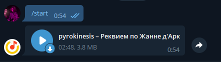

<p align="center">
    
</p>

# YMMBBot
Простой бот для отображения текущей песни.
<br>**Поддерживается Моя Волна Через Last.fm**

# Как использовать?
Сначала, вам надо установить Python и зависимости бота.
<br>Позже - создать самого бота у BotFather и включить у него Inline Mode.

## Скачиваем ymmbbot
```shell
git clone https://github.com/MIPOHBOPOHIH/ymmbbot
# Вам надо быть в `ymmbbot` для дальнейшей работы
cd ymmbbot
```

## Устанавливаем зависимости
```shell
# Допустим, вы уже установили python3
pip install pip --upgrade
pip install -r requirements.txt
```

После этого вы должны заполнить `config.py`.
<br>После заполнения читайте следующую главу.

## Запускаем
```shell
python bot.py
```
# Картинки-примеры
<table>
  <tr>
    <td>Сообщение от бота в канале</td>
    <td></td>
  </tr>
  <tr>
    <td>Ответ бота в личных сообщениях</td>
    <td></td>
  </tr>
  <tr>
    <td>Inline в чатах</td>
    <td></td>
  </tr>
</table>
